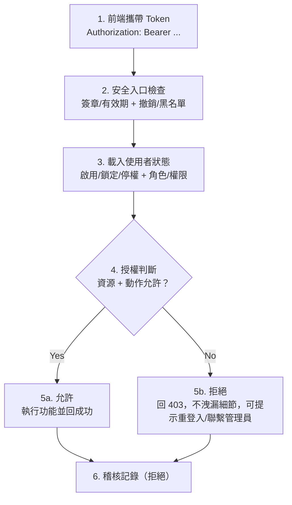

# SA 驗證與授權流程（圖解版）

下圖為「帶 token 的 API 請求」到「授權決策與回應」的流程，並附簡易說明（非技術讀者也可理解）。

## 說明（步驟對應）
- [1] 前端每次呼叫受保護 API 都會帶上 Token（像是數位通行證）。
- [2] 入口先驗證 Token 真實性與期限，並確認沒有被撤銷或列入黑名單。
- [3] 系統讀取帳號狀態，確定帳號沒被鎖定/停權，並整理此人擁有的角色與權限。
- [4] 將請求的「資源 + 動作」與使用者權限比對，預設拒絕，只有明確授權才放行。
- [5a] 若允許，執行功能並回傳成功結果；[5b] 若拒絕，回 403，訊息不洩漏內部細節，並可提示重新登入或聯繫管理員。
- [6] 不論成功或拒絕都記錄稽核事件，內容包含使用者、資源、動作、決策、原因、IP/裝置、時間，方便追蹤。

## Refresh 與會話管理補充
- Refresh：使用 refresh token 換新 access 時，仍需通過「撤銷/過期」檢查；無效則回 401 並要求重新登入。
- 多裝置會話：可列出並撤銷特定會話；一旦撤銷，該會話後續請求立即被拒絕。
- 閒置逾時（30 分鐘）：前端提示並登出；逾時 token 的後端請求會被拒絕。
