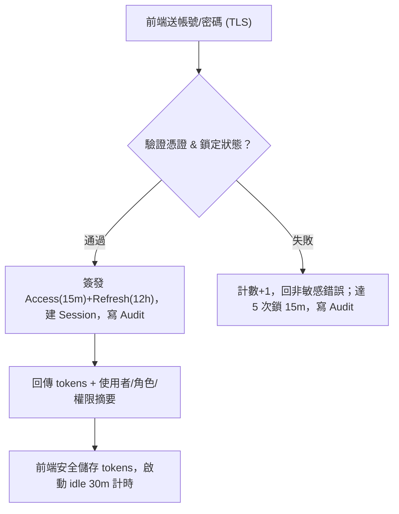
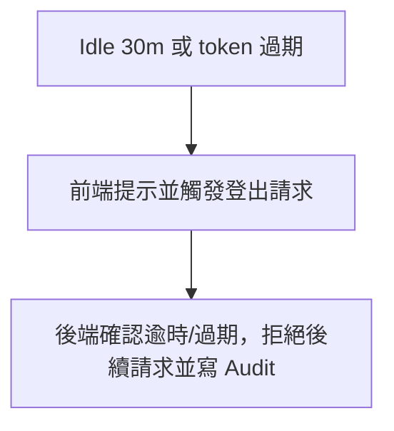
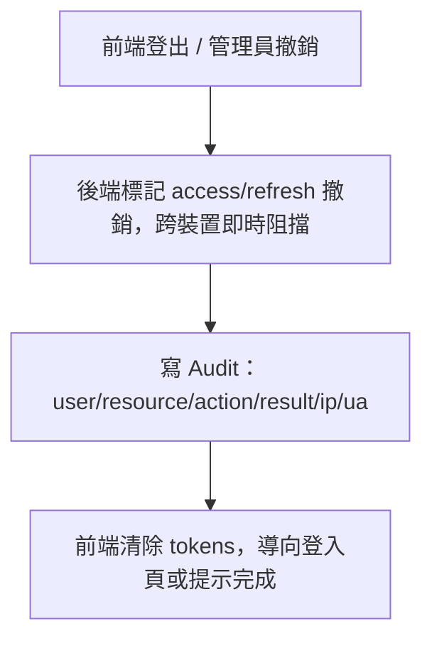
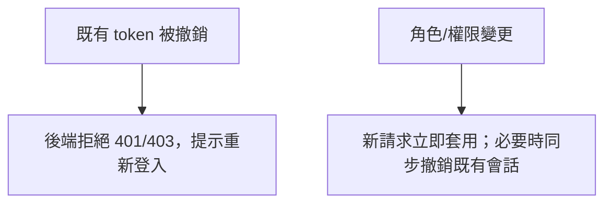

# SA 登入 / 登出流程（Mermaid）

## 圖 1：登入成功/失敗

  

    使用者送出帳密，若通過則簽發 tokens 並建 Session；失敗累計達 5 次會鎖定 15 分鐘並記錄稽核。
  

  

  

  

## 圖 2：閒置逾時 / Token 過期

  

    閒置 30 分鐘或 token 過期時，前端提示並發出登出，後端拒絕逾時請求並記錄稽核。
  

  

  

  

## 圖 3：登出 / 撤銷（含跨裝置）

  

    登出或管理員撤銷會讓 access/refresh 立即失效，跨裝置阻擋後續請求，並寫稽核後清除本機 tokens。
  

  

  

  

## 圖 4：特殊情境

  

    Token 已被撤銷時請求會被拒絕；角色/權限變更對新請求立即生效，必要時可同步撤銷既有會話。
  

  

  

  

## 說明
- 驗證：登入時檢查憑證與鎖定，通過才簽發 token 並記錄稽核；失敗計數達 5 次鎖 15 分鐘。
- 逾時：前端 30 分鐘閒置觸發登出；逾時或撤銷的 token 會被後端拒絕並記錄。
- 撤銷：登出/管理員撤銷會讓 access/refresh 立即失效，跨裝置阻擋後續請求並寫稽核。
- 角色變更：新請求套用最新權限；如需強制即時生效，可撤銷舊會話。
