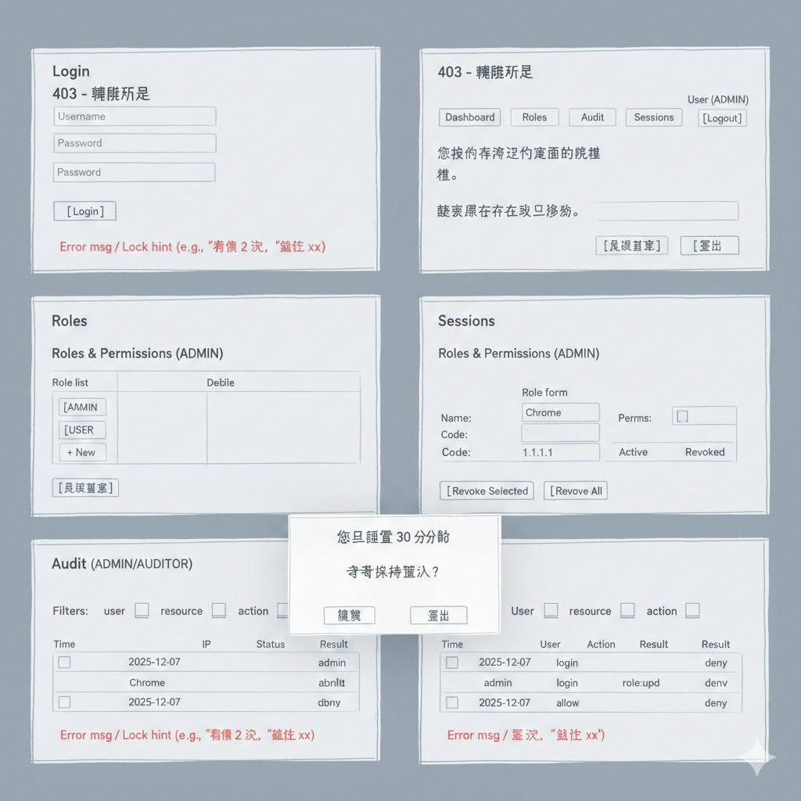

# SA UX Wireframes

> 若採用提供的設計圖，請將該圖另存為 `docs/wireframes/login-rbac.png`，並以 Markdown 引用：  
> ``  
> 下方保留文字/ASCII 線框作為備援與對照。

以下為 ASCII 線框，對應主要頁面。可後續移轉 Figma/設計工具。

## Login Page
```
┌────────────────────────────┐
│  Login                     │
│  ┌──────────────────────┐  │
│  │ Username [         ] │  │
│  │ Password [         ] │  │
│  │ [ Login ]            │  │
│  └──────────────────────┘  │
│  Error msg / Lock hint     │
│  (e.g., "剩餘 2 次", "鎖定 xx")│
└────────────────────────────┘
```

## Unauthorized (403)
```
┌────────────────────────────┐
│  403 - 權限不足             │
│  您沒有存取這個頁面的權限。   │
│  [ 返回首頁 ]  [ 登出 ]     │
└────────────────────────────┘
```

## Not Found (404)
```
┌────────────────────────────┐
│  404 - 找不到頁面           │
│  該資源不存在或已移除。      │
│  [ 返回首頁 ]               │
└────────────────────────────┘
```

## Header / Navigation（登入後）
```
┌──────────────────────────────────────────────┐
│ Logo | Dashboard | Roles | Audit | Sessions  │
│                                  User (ADMIN)│
│                                  [ Logout ]  │
└──────────────────────────────────────────────┘
```

## Roles & Permissions (ADMIN)
```
┌────────────────────────────┐
│ Roles                      │
│ ┌────────────┬───────────┐ │
│ │ Role list  │ Role form │ │
│ │ [ADMIN]    │ Name:     │ │
│ │ [USER ]    │ Code:     │ │
│ │ [+ New]    │ Perms: [ ]│ │
│ └────────────┴───────────┘ │
└────────────────────────────┘
```

## Sessions (self / admin view)
```
┌────────────────────────────────────────────┐
│ Sessions                                   │
│ ┌─────┬───────────┬──────────┬──────────┐  │
│ │Sel  │ Device     │ IP       │ Status  │  │
│ │[ ]  │ Chrome     │ 1.1.1.1  │ Active  │  │
│ │[ ]  │ Mobile     │ 2.2.2.2  │ Revoked │  │
│ └─────┴───────────┴──────────┴──────────┘  │
│ [ Revoke Selected ]   [ Revoke All ]       │
└────────────────────────────────────────────┘
```

## Audit (ADMIN/AUDITOR)
```
┌────────────────────────────────────────────┐
│ Audit                                      │
│ Filters: user [   ] resource [   ] action [ ]│
│ ┌─────────────┬──────────┬─────────┬──────┐│
│ │ Time        │ User     │ Action  │ Result││
│ │ 2025-12-07  │ admin    │ login   │ allow ││
│ │ 2025-12-07  │ alice    │ role:upd│ deny  ││
│ └─────────────┴──────────┴─────────┴──────┘│
└────────────────────────────────────────────┘
```

## Idle Timeout Prompt
```
┌────────────────────────────┐
│ 您已閒置 30 分鐘            │
│ 是否保持登入？              │
│ [ 繼續 ]   [ 登出 ]         │
└────────────────────────────┘
```

