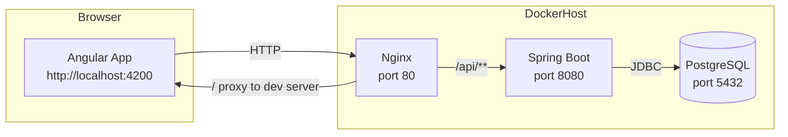

# 系統架構圖（開發環境）

## 說明
- 瀏覽器透過 Nginx 進入系統；開發階段 Nginx 反向代理到 Angular dev server（4200）與 Spring Boot（8080）。
- Nginx 統一入口，未來可加上 TLS、快取、壓縮與限流。
- 後端使用 PostgreSQL（Flyway 管理 schema），JDBC 直連。
- docker-compose 啟動 nginx/backend/db，前端 dev 可在 host 4200 由 Nginx 轉發。
