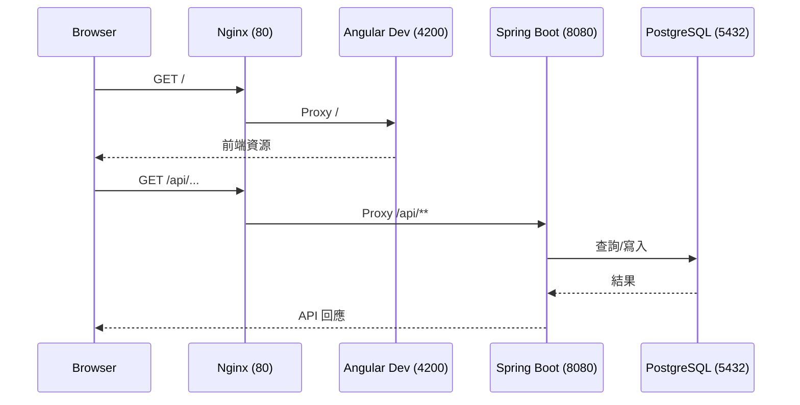

# 部署與請求流程（開發環境）

## 說明
- 開發：使用 `ng serve` 在 4200，Nginx 代理 `/` 到前端、`/api/**` 到 Spring Boot。
- 後端連接 PostgreSQL（docker-compose 中由服務名稱 `db` 提供），Flyway 負責 schema 管理。
- 後續可將前端 build 結果掛載給 Nginx，或改由後端提供靜態檔；若上雲，再掛載 TLS 憑證與調整 upstream。
